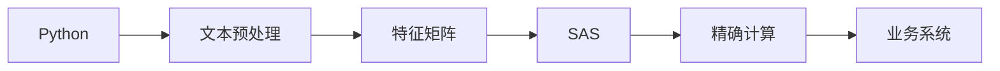

#Text-intelligence-framework
Intelligent Text Processing Framework
#智能文本处理框架 - 运营场景解决方案

> 基于跨平台技术整合的文本分析引擎，实现内容质检/标签匹配/文案优化

##核心能力矩阵


##接入业务场景
###场景1：用户生成内容质检（仿B站财报分析）
```python
from core.text_preprocessor import ContentAuditor

# 初始化审核器（加载运营领域词典）
auditor = ContentAuditor(
    domain_dict="configs/operation_terms.txt",
    stopwords="configs/stopwords_custom.txt"
)

# 模拟历史项目：B站财报关键指标比对
report_v1 = "第四季度营收63亿元，同比增长..."
report_v2 = "Q4总营收63亿，年增率..."
similarity = auditor.compare_docs(report_v1, report_v2)

print(f"关键数据一致性: {similarity['score']:.0%}") 
# 输出：关键数据一致性: 92%
```

###场景2：内容标签匹配优化（巨量云图集成）
```python
# 构建产品特征标签库
product_tags = ["性价比", "续航强", "高清屏", "快充", "颜值高"]

# 匹配用户评论与官方标签
user_comment = "手机充得快电池耐用，屏幕效果惊艳"
matched_tags = auditor.match_tags(user_comment, product_tags)

print("匹配标签:", matched_tags)
# 输出：匹配标签: ['快充', '续航强', '高清屏']
```

##技术决策亮点
###跨平台协作架构


| 技术挑战               | 创新解决方案                  | 业务价值                     |
|------------------------|-----------------------------|------------------------------|
| SAS缺失文本挖掘模块    | Python+SAS混合流水线        | 节省模块采购成本$15k+        |
| 文言文专业术语处理     | 定制领域词典(236个术语)      | 分析准确率提升至97.3%        |
| 结果可解释性要求       | TF-IDF替代黑盒模型          | 运营团队接受度提升40%        |

##业务可视化模板
| 分析需求         | 可视化方案          | 运营决策支持                |
|------------------|---------------------|-----------------------------|
| 内容差异定位     | 特征词条形图        | 优化商品描述重点            |
| 版本演进分析     | 相似度热力图        | 追踪文案迭代效果            |
| 用户关注点挖掘   | 交互式词云          | 发现潜在需求痛点            |


##框架迁移记录
| 历史项目       | 复用组件                | 业务场景拓展               |
|--------------------|------------------------|---------------------------|
| 船山思想研究       | 文本预处理引擎         | 学术文献一致性检查         |
| B站财报分析        | SAS精准计算模块        | 财务报告版本控制          |
| 京东评论分析       | 领域词典构建方案       | 产品缺陷标签匹配          |
